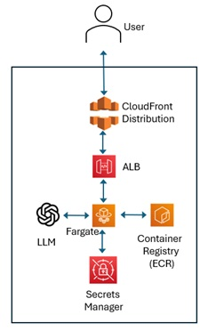

# A Reusable Recipe for an End-to-End Build and Deploy of a Fully Functioning Agentic App

Simple Financial Research assistant Agent to be hosted using Streamlit with code to deploy to AWS using CDK.

For a detailed explanation: https://medium.com/@venkat.ramrao/a-recipe-for-an-end-to-end-build-and-deploy-of-a-fully-functioning-agentic-app-a0da58154536

Here is the architure I am deploying.


               
## Steps to deploy
### 1. Create a STreamlit App
### 2. Dockerize
```bash
docker build -f Dockerfile -t app:latest .
docker run -p 8501:8501 app:latest
```
### 3. Deploy to AWS using CDK
#### Step 1: Install CDK and AWS Console
#### Step 2: create a working folder
```bash
mkdir cdk && cd cdk
```
#### Step 4: Run init to create a new Project
```bash
cdk init app --language python
```
#### Step 5 - Create a Virtual Environment and install the dependencies.
```bash
python3 -m venv .env
source .env/bin/activate 
pip install --upgrade pip
pip install -r requirements.txt
```
#### Step 6 - replace the default CDK Stack with the one you created (cdk_stack.py) and set up additional folfer structure
#### Step 7 - Deploy
You need to bootstrap the environment if this is the first time running the environment
```bash
cdk bootstrap
```
Otherwise, simply run
```bash
cdk deploy
```
You may need to adjust permissions on your user
#### Step 8 - DESTROY THE DEPLOYMENT AFTER USE!!!
```bash
cdk destroy
```


